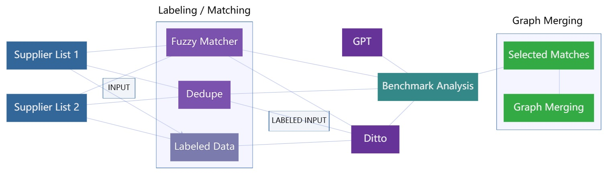

# Knowledge Graphs Integration in the Context of Supply Chain Risk Management on a Siemens Use Case

**Type:** Master's Thesis

**Author:** Rebeka Gadzo

**1st Examiner:** Prof. Dr. Stefan Lessmann 

**2nd Examiner:** xxx 



## Table of Content

- [Summary](#Summary)
- [Working with the repo](#Working-with-the-repo)
    - [Dependencies](#Dependencies)
    - [Setup](#Setup)
- [Reproducing results](#Reproducing-results)
    - [Training code](#Training-code)
    - [Evaluation code](#Evaluation-code)
    - [Pretrained models](#Pretrained-models)
- [Project structure](#Project-Structure)

## Summary

Supply chain risk management plays a crucial role in ensuring the smooth functioning and resilience of supply chains. Knowledge graphs have emerged as a valuable tool for capturing, organizing, and utilizing complex supply chain information. By leveraging the capabilities of knowledge graphs, organizations can enhance their understanding of supply chain dynamics, identify potential risks, and develop effective mitigation strategies. This study focuses just on the supply chain context of Siemens AG, with the intention to produce generalized results and implications which can be applied for other use cases as well.

The GitHub repository provides the practical part of the given thesis. In this research, we focused on integrating knowledge graphs into a company's supply chain to address specific risk management challenges. To achieve this, we employed four different integration methods and conducted a comprehensive benchmark analysis to evaluate their effectiveness. This repository covers knowledge graph extraction, data preparation, and entity matching tasks. It includes various essential components such as data collection, where knowledge graphs are extracted from different sources. The data preparation phase focuses on standardizing formats, converting text to lowercase, performing translations, and extracting relevant information. To create ground truth for supervised learning, the repository offers data labeling capabilities. For entity matching, the repository implements a range of solutions including unsupervised approaches like Fuzzy Matching and GPT, as well as semi-unsupervised approach like Dedupe. Additionally, supervised solution Ditto, which leverages BERT, is also included. Evaluation metrics are provided to assess the performance of the implemented entity matching solutions. The process of graphs merging is also covered by this repository as well as accompanying cypher queries that can be applied for these purposes. The repository also offers tools for visualization and plotting of the results.

The benchmark analysis revealed that GPT has been proven to be the most precise and reliable solution, but given the scope and cost limitations, Dedupe has emerged as the to go solution for this particular use case study. In contrast to supervised methods, Dedupe requires low effort and time to be set-up. Relied on the benchmark analysis, the practical part of this thesis additionally resulted in extending supply chain knowledge graph by incorporating macroeconomic data based on the Dedupe matching results. This integration enriched the graph's overall understanding of the supply chain ecosystem, enabling a more comprehensive and accurate assessment of potential risks.


**Keywords**: Knowledge Graphs Integration, Supply Chain Risk Management, Entity Alignment, Pre-trained Language Models, Transformers, Case Study

## Working with the repo

### Dependencies

#### Global
Python: 3.7.7
Requirements can be installed using the command bellow

     pip install -r requirements.txt 

#### Fuzzy Matcher
Code with further details is accessible [here](https://github.com/RobinL/fuzzymatcher)
Library can be installed using the command bellow

    pip install fuzzymatcher

#### Csvdedupe (csvlink)
Code with further details is accessible [here](https://github.com/dedupeio/csvdedupe)
Library can be installed using the command bellow

    pip install csvdedupe
    
#### Ditto
Code with further details is accessible [here](https://github.com/megagonlabs/ditto)
Most of the dependencies will be installed through requirements.txt. Additional required dependencies are following. Note that Ditto was code modified to use CPU only version. 

###### Spacy
Spacy models can be installed using

    python -m spacy download en_core_web_lg
    python -m nltk.downloader stopwords

###### Blocking
In order to  perform blocking in folder `/blocking/sentence-transformers` git repository must be [cloned](https://github.com/UKPLab/sentence-transformers/tree/5634c8a8b0caf22890fc455f2a2591fd25cbefb3) and installed using the cloned requirements.txt.


###### Hugging Faces 4.9.2
Detailed installation guide is available [here](https://huggingface.co/docs/transformers/installation).


    python -m venv .env          # Create a virtual environment
    .env/Scripts/activate        # Activate the environment
    pip install transformers     # Install transformers
    
Installation can be tested using
    
    python -c "from transformers import pipeline; print(pipeline('sentiment-analysis')('we love you'))"
#### GPT
    
    pip install openai
    
#### Plotting

     pip install basemap
     python -m pip install -U matplotlib

    
#### Demo Matcher Server
Detailed installation guide can be found [here](https://fastapi.tiangolo.com/tutorial/)

    pip install fastapi
    pip install "uvicorn[standard]"
    
In `server_config.py` default configurable server port is `8000`.

Note that following Ditto models must be trained before Ditto matcher execution:

    SCM-COYPU/DE    SCM-COYPU/UNPARSED/DE
    SCM-COYPU/US    SCM-COYPU/UNPARSED/US
    SCM-COYPU/CN    SCM-COYPU/UNPARSED/CN

In order to run GPT Matcher openai must be installed. In `openai_matcher.py` openai.api_key must be configured to use valid openai key. Key can be generated [here](https://platform.openai.com/account/api-keys). 
For demo purposes of the company matcher, refer to the following pdf file: (ADD PDF FILE PATH).

### Setup
#### Csvdedupe (csvlink)
In order to generate eligeable files for running csvlink, it is required to first execute the following two notebooks `data_preprocessing.ipynb` and `data_preprocessing_dedupe.ipynb`. Using data prep output files `SCM_prep_data_ID.csv` and `COYPU_prep_data.csv` csvlink can be used with the below shown command. Note that for each of the country csvlink must be executed separately.

    csvlink dedupe/data/csv_files/scm_germany.csv dedupe/data/csv_files/coypu_germany.csv \
              --config_file=dedupe/config_dedupe_de.json
#### Ditto
Scripts for all language are avaiable on project root level. Blocking training is optional pretrained model can be used instead. Scripts for languages can be separately executed. 
Order of execution is following:

1. Blocking training (Optional)
2. Blocking execution
3. Ditto training
4. Ditto execution

 Note that bash scripts must be edited for different types of Ditto input types. 
 Following input types are available:
 
 1. FULL (includes geolocation, company category and parsed name)
 2. NO-LOC (company category and parsed name)
 3. UNPARSED (raw name only)
 4. AL (same as FULL, used for alternative training sets)
 
Additional Ditto blocking information and commands can be found [here](https://github.com/megagonlabs/ditto/tree/master/blocking).


List of all Ditto tasks can be found in `configs.json`. In order to run those tasks, related input files must be provided which are generated through `data_preprocessing.ipynb` and `data_preprocessing_ditto.ipynb`.

Additional information about Ditto execution and parameters can be found [here](https://github.com/megagonlabs/ditto/tree/master).

#### GPT
Create a python script and call script using the following template

    from openai_matcher import match_companies
    
    #   Company
    #   {
    #        'name': str,
    #        'lat'?: float, 
    #        'long'?: float, 
    #   }

    res = match_companies(companyA, companyB)

## Reproducing Results
### Training code
First step towards reproducing results is to run following in order
1. `data_preprocessing.ipynb`
2. `fuzzy_matcher.ipynb`
3. `data_preprocessing_dedupe.ipynb`
4. *Execute csvdedupe*
5. `fuzzy_ditto.ipynb` 
6. `data_preprocessing_ditto.ipynb`

Second optional step is using dedupe and fuzzy matcher in order to create training data. Through preparation scripts text distance based labeling files will be generated. Using results from unsupervised tehniques such as dedupe to create training data has proven to show better results.

#### Fuzzy Matcher
Fuzzy matcher results become available through notebook execution.

#### Csvdedupe
Using the notebook output run scripts as described in Setup. Output results will vary based on the manual input provided. Manual input can be persisted and used for later matching. Csvdedupe country must be executed separately for each of the countries.

#### Ditto
Move data prep output files `SCM_prep_data_ID.csv` and `COYPU_prep_data.csv` or configure paths as necessary. Follow script execution order as provided in Setup. Each of the execution step relies on the previous one. Each input configuration for each country can be executed separately from others. 

Blocking model we have used are` distilbert-base-uncased-finetuned-sst-2-english` and `bert-base-german-cased`.

#### GPT
Load an evaluation dataset to a script created in setup and run execute it for each entry.

#### Demo Matcher Server
Simply execute `server.py`. Server configuration is available `server_config.py`. Default browser will be automatically launched or a new tab will be created if it's already launched. Server can be started without ditto models, but those models must be commented out in server configuration. User manual is available in [CompanyMatcher.pdf](./CompanyMatcher.pdf)

### Evaluation code
Map company plotting is available in `/plotting/world_plots.ipynb`
ROC AUC plotting is available in `/plotting/auc_plotting.ipynb`

### Pretrained models
#### Ditto
All Ditto models can be pretrained using the information above. Ditto will automatically decide all model weights. List of all pretrained models for blocking can be found in  `/blocking/sentence-transformers/sentence_transformers/SentenceTransformers.py`
#### GPT
GPT was configured to use `gpt-3.5-turbo`. Other available models and their pricing can be found [here](https://openai.com/pricing).

### Graph Merging
Graph merging requires Dedupe results or any other result file, which follows structure noted in `merging.ipynb`.
1. First step is to export relevant data from both graphs using queries available in file `sparql_queries.txt`.
2. Further, import query results graph data to `graphs_merging` folder and execute `merging.ipynb`.
3. Once that is done in Neo4j execute queries from file `cypher_queries.txt`. Note that event data can be merged separately from company data.


## Project structure

```bash

├── .gitignore
├── .gitmodules
├── LICENSE
├── README.md
├── server.py                                 -- demo server script
├── server_config.py                          -- demo server config
├── static                                    -- server static files
├── supplier_matching.png                     -- supplier matching graph
├── train_ditto.py                            -- ditto train script
├── util.py                                   -- ditto util
├── learned_settings                          -- ditto learned settings
├── matcher.py                                -- execute ditto
├── requirements.txt                          -- project requirements
├── CompanyMatcher.pdf                        -- demo user guide
├── configs.json                              -- ditto configs
├── ditto.jpg                                 -- ditto architecture
├── ditto_scripts                             -- ditto execution scripts
│   ├── blocking_execute_cn.sh                -- ditto blocking execute cn          
│   ├── blocking_execute_de.sh                -- ditto blocking execute de
│   ├── blocking_execute_us.sh                -- ditto blocking execute us
│   ├── blocking_training_cn.sh               -- ditto blocking train cn
│   ├── blocking_training_de.sh               -- ditto blocking train de
│   ├── blocking_training_us.sh               -- ditto blocking train us
│   ├── ditto_match_cn.sh                     -- ditto execute cn
│   ├── ditto_match_de.sh                     -- ditto execute de
│   ├── ditto_match_us.sh                     -- ditto execute us
│   ├── ditto_train_cn.sh                     -- ditto train cn
│   ├── ditto_train_de.sh                     -- ditto train de
│   ├── ditto_train_us.sh                     -- ditto train us
│   └── ditto_execute_all.sh                  -- ditto run all scripts
├── blocking_ditto                            -- blocking for ditto
│   ├── README.md
│   ├── sentence-transformers                 -- submodule
│   ├── blocker.py                            -- execute ditto blocking
│   ├── train_blocker.py                      -- train ditto blocking
│   └── input_block                           -- train data
│       └── separate_data.py                  -- separate data to train, test, and val
├── data_preparation                          -- data preparation
│   ├── data_preprocessing.ipynb              -- prepare data
│   ├── data_prep_consts.py                   -- data preparation constants
│   ├── data_prep_util.py                     -- data preparation utils
│   ├── id_merging.ipynb                      -- util for adding scm ids
│   ├── geolocation                           -- folder, contains geolocation data
│   ├── data                                  -- contains data prep files 
│   └── graphs_generation_code                -- contains graph queries
│       ├── coypu.txt                         -- coypu queries
│       └── scm.txt                           -- scm queries
├── dedupe                                    -- contains dedupe execution code
│   ├── config_dedupe_cn.json                 -- dedupe config cn
│   ├── config_dedupe_de.json                 -- dedupe config de
│   ├── config_dedupe_us.json                 -- dedupe config us
│   ├── data_preprocessing_dedupe.ipynb       -- prepare data for dedupe
│   ├── execute_cn.sh                         -- execute dedupe cn
│   ├── execute_de.sh                         -- execute dedupe de
│   ├── execute_us.sh                         -- execute dedupe us
│   └── data                                  -- dedupe files
├── ditto_light                               -- ditto source code
│   ├── augment.py                            -- ditto augmenter class
│   ├── dataset.py                            -- ditto dataset class
│   ├── ditto.py                              -- ditto model class
│   ├── exceptions.py                         -- ditto exceptions
│   ├── knowledge.py                          -- ditto domain knowledge injector
│   └── summarize.py                          -- ditto summarizer class
├── ditto_prep                                -- ditto data preparation
│   ├── data_preprocessing_ditto.ipynb        -- prepare ditto data
│   ├── data_prep_consts.py                   -- ditto preparation consts
│   ├── data_prep_ditto_util.py               -- ditto preparation util
│   ├── fuzzy_ditto.ipynb                     -- transform fuzzy output for ditto
│   └── data                                  -- ditto files
├── results_ditto                             -- ditto show results
│   └── read_results.py                       -- ditto result reader
├── fuzzy_matcher                             -- fuzzy matcher execution code
│   └── fuzzy_matcher.ipynb                   -- execute fuzzy matcher
├── gpt                                       -- gpt matcher code
│   ├── evaluate.py                           -- gpt match evaluation
│   └── openai_matcher.py                     -- gpt supplier matcher
├── graphs_merging                            -- graphs merging code
│   ├── cypher_queries.txt                    -- queries for scm graph integration
│   ├── sparql_queries.txt                    -- queries exporting coypu graph
│   ├── merging.ipynb                         -- create merged graphs
│   └── graph_data                            -- graph merging files
├── output                                    -- ditto output files
│   └── queries                               -- demo client default target folder
└── plotting                                  -- plotting code
├── auc_plotting.ipynb                        -- plot roc auc curve
├── plot_fuzzy.ipynb                          -- plot fuzzy results
├── world_plots.ipynb                         -- plot maps
└── results                                   -- roc auc plotting output

                 
```
